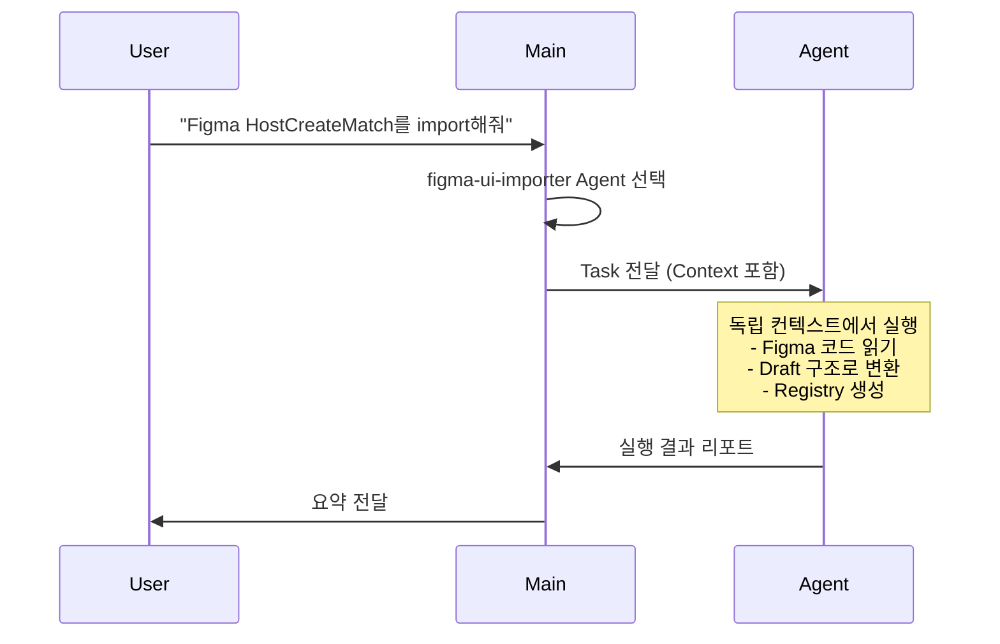

# Context 관리 가이드

> Subagent 실행 시 컨텍스트 관리 및 기록 방법

**Last Updated**: 2025-12-31

---

## 📚 Context 구조

Claude Code에서 Subagent는 **독립적인 컨텍스트**를 가집니다:

```
Main Conversation (메인 대화)
  ├─ 전체 프로젝트 컨텍스트
  ├─ 사용자 대화 기록
  └─ Agent 실행 결과 요약

Subagent Context (독립 컨텍스트)
  ├─ Agent 전용 System Prompt
  ├─ 실행 시점의 파일 상태
  ├─ Agent가 수행한 작업
  └─ 결과 리포트
```

---

## 🤖 Subagent별 Context 관리

### 1. figma-ui-importer

**Purpose**: Figma Make 코드를 Draft Registry로 변환

#### Input Context (Agent가 받는 정보)

| 항목 | 출처 | 용도 |
|------|------|------|
| Figma Make 코드 | `/tmp/figma-sample/src/pages/*.tsx` | 변환할 소스 코드 |
| Draft 구조 | `src/components/registry/` | 목표 디렉토리 구조 |
| 명명 규칙 | `ARCHITECTURE.md` | 파일명 규칙 |
| 변환 스크립트 | `scripts/import-figma-component.py` | 자동화 도구 |

#### Output Context (Agent가 생성하는 정보)

```
✅ Figma 컴포넌트 Import 완료

Component: host-create-match
Location: src/components/registry/host-create-match/
Category: form
Source: HostCreateMatch.tsx

생성된 파일:
- index.tsx (AUTO-GENERATED 헤더 포함)
- metadata.yaml
- README.md

다음 단계:
1. TypeScript 에러 확인: npx tsc --noEmit
2. App Router에 연결: app/(...)/page.tsx
3. 테스트: npm run dev
```

#### Context 기록 위치

- **Agent 실행 로그**: `.claude/logs/figma-ui-importer-{timestamp}.log` (자동 생성)
- **생성된 파일 헤더**: `src/components/registry/*/index.tsx` (AUTO-GENERATED 주석)
- **Metadata**: `src/components/registry/*/metadata.yaml`

---

### 2. Pipeline-Designer (기존 Agent 예시)

**Purpose**: 브랜드 로고 찾기

#### Input Context

| 항목 | 출처 | 용도 |
|------|------|------|
| 브랜드 이름 | User Input | 검색 키워드 |
| WebSearch | Tool | 공식 도메인 찾기 |
| WebFetch | Tool | Brandfetch 페이지 크롤링 |

#### Output Context

```
Brand Name: Spotify
Brandfetch URL: https://brandfetch.com/spotify.com
Logo URLs: [SVG, PNG links]
Brand Colors: #1DB954, #191414
```

---

## 📝 Context 기록 방법

### 1. AUTO-GENERATED 헤더 (파일 레벨)

모든 Agent 생성 파일에 포함:

```typescript
/**
 * 🤖 AUTO-GENERATED by {agent-name}
 * 생성일: {YYYY-MM-DD HH:mm:ss}
 * Agent: .claude/agents/{agent-name}.md
 *
 * ⚠️ 이 파일은 Agent가 자동 생성한 파일입니다.
 * 수동 수정 시 다음 Agent 실행 시 덮어쓰여질 수 있습니다.
 *
 * Source: {원본 파일 경로 또는 URL}
 */
```

**예시**:
```tsx
/**
 * 🤖 AUTO-GENERATED by figma-ui-importer
 * 생성일: 2025-12-31 16:45:23
 * Agent: .claude/agents/figma-ui-importer.md
 *
 * ⚠️ 이 파일은 Figma Make에서 자동 변환된 파일입니다.
 *
 * Source: /tmp/figma-sample/src/pages/HostCreateMatch.tsx
 */
```

---

### 2. Metadata 파일 (컴포넌트 레벨)

```yaml
# src/components/registry/host-create-match/metadata.yaml
name: host-create-match
category: form
description: Host create match form imported from Figma Make
source:
  type: figma
  url: https://github.com/beom84/Creatematchform
  imported_at: "2025-12-31T16:45:23+09:00"
  original_file: /tmp/figma-sample/src/pages/HostCreateMatch.tsx
  agent: figma-ui-importer
status: draft
tags: []
keywords: []
last_updated: "2025-12-31T16:45:23+09:00"
```

---

### 3. Agent 실행 로그 (프로젝트 레벨)

```json
// .claude/logs/agent-executions.json
{
  "executions": [
    {
      "agent": "figma-ui-importer",
      "timestamp": "2025-12-31T16:45:23+09:00",
      "input": {
        "source_file": "/tmp/figma-sample/src/pages/HostCreateMatch.tsx",
        "component_name": "host-create-match",
        "category": "form"
      },
      "output": {
        "status": "success",
        "files_created": [
          "src/components/registry/host-create-match/index.tsx",
          "src/components/registry/host-create-match/metadata.yaml",
          "src/components/registry/host-create-match/README.md"
        ],
        "typescript_errors": 0
      },
      "duration_ms": 1234,
      "agent_id": "abc123"
    }
  ]
}
```

---

## 🔄 Context 전파 플로우

### Main → Subagent



### Context 전달 내용

Main에서 Agent로 전달:
1. **명시적 정보**: User 요청 ("HostCreateMatch import")
2. **암묵적 정보**:
   - 프로젝트 루트 경로
   - 현재 Git 상태
   - 파일 시스템 구조

Agent에서 Main으로 전달:
1. **실행 결과**: 성공/실패
2. **생성된 파일 목록**
3. **다음 단계 제안**
4. **에러 (있다면)**

---

## 📊 Context 추적 시스템

### 1. 파일 추적

**생성된 파일 확인**:
```bash
# AUTO-GENERATED 헤더가 있는 파일 찾기
grep -r "🤖 AUTO-GENERATED" src/
```

**특정 Agent가 생성한 파일**:
```bash
grep -r "AUTO-GENERATED by figma-ui-importer" src/
```

### 2. Metadata 추적

**Registry 컴포넌트 목록**:
```bash
find src/components/registry -name "metadata.yaml"
```

**Figma에서 가져온 컴포넌트**:
```bash
grep -r "type: figma" src/components/registry/*/metadata.yaml
```

### 3. 변경 이력 추적

**Git을 통한 추적**:
```bash
# Agent가 생성한 파일의 커밋 이력
git log --all --source --full-history -- src/components/registry/
```

---

## 🛡️ Context 격리 규칙

### Agent는 다음을 **볼 수 없음**:

- ❌ Main 대화의 이전 메시지
- ❌ 다른 Agent의 실행 컨텍스트
- ❌ User의 개인 설정 (일부 예외)

### Agent는 다음을 **볼 수 있음**:

- ✅ 파일 시스템 (허용된 도구로)
- ✅ Agent System Prompt
- ✅ Task 설명 (Main이 전달한 내용)
- ✅ 실행 시점의 Git 상태

---

## 📖 Context 재사용 가이드

### Agent Resume 기능

Agent를 resume하면 이전 컨텍스트를 유지:

```
# 첫 실행
> Figma HostCreateMatch를 import해줘

[Agent 실행, agent_id: abc123]

# Resume (같은 컨텍스트 유지)
> Agent abc123를 resume해서 TypeScript 에러 수정해줘

[Agent가 이전 작업 기억하며 계속 진행]
```

### 언제 Resume을 사용하나?

- ✅ 같은 컴포넌트 추가 수정
- ✅ 에러 수정 후 재시도
- ✅ 단계적 작업 (Import → 검증 → 수정)

### 언제 새로 실행하나?

- ✅ 다른 컴포넌트 Import
- ✅ 완전히 다른 작업
- ✅ Agent 로직 변경 후

---

## 🔍 디버깅: Context 문제 해결

### 문제 1: Agent가 이전 작업을 기억 못함

**원인**: 새 Agent 실행 (Resume 안 함)
**해결**:
```bash
# Agent ID 확인
cat .claude/logs/agent-executions.json | jq '.executions[-1].agent_id'

# Resume
> Agent {agent_id}를 resume해줘
```

### 문제 2: Agent가 잘못된 파일 경로 사용

**원인**: Figma 리포지토리 경로 변경
**해결**:
1. `.claude/agents/figma-ui-importer.md` 업데이트
2. 경로 하드코딩 제거, 동적 탐색 추가

### 문제 3: 생성된 파일 구분 안 됨

**원인**: AUTO-GENERATED 헤더 누락
**해결**:
```bash
# 모든 Registry 파일에 헤더 추가
for file in src/components/registry/*/index.tsx; do
  # 헤더 없으면 추가
  grep -q "AUTO-GENERATED" "$file" || \
    echo "/**\n * 🤖 AUTO-GENERATED\n */" | cat - "$file" > temp && mv temp "$file"
done
```

---

## 📚 참고 문서

- [Subagent 공식 문서](.claude/docs/sub-agent.md)
- [화면 플로우](.claude/docs/screen-flow.md)
- [아키텍처](../../ARCHITECTURE.md)

---

**Last Updated**: 2025-12-31
**For**: Subagent Development & Debugging
