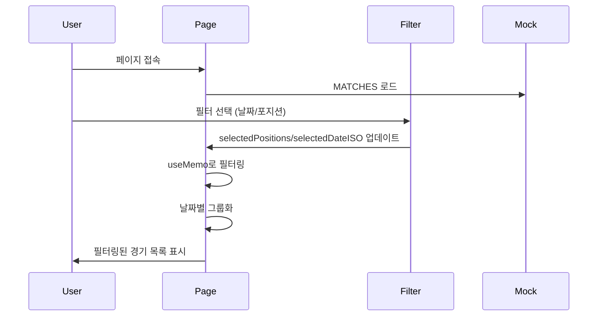

# Draft 프로젝트 화면 플로우

> 디버깅 및 Agent 참고용 화면 구조 문서

**Last Updated**: 2025-12-31

---

## 📱 전체 화면 구조

```mermaid
graph TD
    A[app/page.tsx<br/>경기 목록] --> B[app/match/create/page.tsx<br/>경기 생성]
    A --> C[app/guest/[id]/page.tsx<br/>경기 상세]
    A --> D[app/my/page.tsx<br/>마이페이지]

    C --> E[신청하기 Drawer]
    B --> F[app/host/dashboard/page.tsx<br/>호스트 대시보드]

    style A fill:#ff6600,color:#fff
    style B fill:#4CAF50,color:#fff
    style C fill:#2196F3,color:#fff
    style D fill:#9C27B0,color:#fff
    style F fill:#FF9800,color:#fff
```

---

## 🗂️ 페이지별 상세 구조

### 1. 메인 페이지 (경기 목록)

**경로**: `app/page.tsx`
**Registry**: _(현재 Draft 직접 구현, Figma 개선 후 Import 예정)_
**역할**: 게스트가 경기를 탐색하고 필터링

#### 화면 구성

```
┌─────────────────────────────────┐
│ Header (widgets/header.tsx)     │
├─────────────────────────────────┤
│ [서울 전체 ▼]  [🔍] [🔔]       │
│─────────────────────────────────│
│ [전체] [1일] [2일] [3일] ...    │ ← DateStrip
│─────────────────────────────────│
│ [포지션무관] [가드] [포워드] [센터] │ ← FilterBar
│─────────────────────────────────│
│                                 │
│ ┌─ 19:00 ──────────────────┐   │
│ │ ~21:00   강남구민회관      │   │
│ │          서울 강남구        │   │
│ │          [가드 0/2] [포워드 1/2] │
│ └─────────────────10,000원─┘   │
│                                 │
│ ┌─ 20:00 ──────────────────┐   │
│ │ ~22:00   반포종합운동장 [마감] │   │
│ │          서울 서초구        │   │
│ └─────────────────15,000원─┘   │
│                                 │
│                        [➕]     │ ← RecruitFAB
├─────────────────────────────────┤
│ BottomNav (widgets/bottom-nav) │
└─────────────────────────────────┘
```

#### 컴포넌트 구조

```tsx
app/page.tsx
├─ @/widgets/header
├─ @/features/match/ui/date-strip → getNext14Days()
├─ @/features/match/ui/filter-bar → FilterBar
├─ @/features/match/ui/match-list-item → MatchListItem (반복)
└─ @/components/ui/recruit-fab → RecruitFAB
```

#### 상태 관리

| State | 타입 | 용도 |
|-------|------|------|
| `selectedPositions` | `string[]` | 선택된 포지션 필터 |
| `selectedDateISO` | `string \| null` | 선택된 날짜 |
| `filteredAndGroupedMatches` | `Record<string, Match[]>` | 필터링 + 그룹화된 경기 |

#### 데이터 플로우

```
MATCHES (Mock Data)
  ↓ Filter by Date
  ↓ Filter by Position (AND 로직)
  ↓ Sort by Date & Time
  ↓ Group by Date
  → filteredAndGroupedMatches
  → Render MatchListItem[]
```

---

### 2. 경기 생성 페이지

**경로**: `app/match/create/page.tsx`
**Registry**: `src/components/registry/host-create-match`
**역할**: 호스트가 새 경기 생성

#### 화면 구성

```
┌─────────────────────────────────┐
│ Header                          │
├─────────────────────────────────┤
│ 경기 개설                        │
│ 게스트 모집을 위한 공고를 만듭니다. │
│                                 │
│ 일시                            │
│ [📅 2025-01-01 19:00]           │
│                                 │
│ 장소                            │
│ [📍 체육관 검색...]              │
│                                 │
│ 참가비 (1인)                     │
│ [💵 10,000]                     │
│                                 │
│ ───────────────────────────    │
│                                 │
│ 포지션별 모집 [스위치 OFF]       │
│ └─ OFF: 총 인원만 입력           │
│ └─ ON:  가드/포워드/센터 개별 설정 │
│                                 │
│ [다음] 버튼                      │
└─────────────────────────────────┘
```

#### 컴포넌트 구조

```tsx
app/match/create/page.tsx
└─ @/components/registry/host-create-match (Figma Import)
    ├─ React Hook Form
    ├─ detailMode (Switch)
    ├─ positions { guard, forward, center }
    └─ onSubmit → router.push('/host/dashboard')
```

#### 폼 필드

| 필드 | 타입 | Required | Validation |
|------|------|----------|-----------|
| date | datetime-local | ✅ | 과거 날짜 방지 (TODO) |
| location | string | ✅ | 최소 2자 (TODO) |
| fee | number | ✅ | 양수만 (TODO) |
| positions | object | ✅ | detailMode에 따라 다름 |

---

### 3. 경기 상세 페이지 (게스트)

**경로**: `app/guest/[id]/page.tsx`
**Registry**: `src/components/registry/guest-match-view`
**역할**: 경기 상세 정보 확인 및 신청

#### 화면 구성

```
┌─────────────────────────────────┐
│ Header                          │
├─────────────────────────────────┤
│ [← 뒤로]              [공유 ⋯]  │
│                                 │
│ 📍 강남구민회관                  │
│    서울시 강남구 대치동           │
│                                 │
│ 🕐 12월 31일 (화) 19:00~21:00  │
│ 💵 10,000원 / 1인               │
│                                 │
│ ───────────────────────────    │
│                                 │
│ 모집 현황                        │
│ [가드 0/2] [포워드 1/2] [센터 0/1] │
│                                 │
│ ───────────────────────────    │
│                                 │
│ 경기 정보                        │
│ • 주차 가능                      │
│ • 샤워실 이용 가능                │
│                                 │
│                                 │
│ [신청하기] 버튼                  │
└─────────────────────────────────┘
```

#### Drawer: 신청하기

```
┌─────────────────────────────────┐
│ 신청하기               [X]      │
├─────────────────────────────────┤
│ 포지션 선택                      │
│ ○ 가드                          │
│ ● 포워드                        │
│ ○ 센터                          │
│                                 │
│ 이름                            │
│ [홍길동]                        │
│                                 │
│ 연락처                          │
│ [010-1234-5678]                 │
│                                 │
│ [신청 완료] 버튼                 │
└─────────────────────────────────┘
```

#### 컴포넌트 구조

```tsx
app/guest/[id]/page.tsx
└─ @/components/registry/guest-match-view
    ├─ Match Detail Info
    ├─ Position Status
    └─ @/features/match/ui/application-drawer
        └─ React Hook Form
```

---

### 4. 호스트 대시보드

**경로**: `app/host/dashboard/page.tsx`
**Registry**: `src/components/registry/host-dashboard`
**역할**: 호스트가 자신이 개설한 경기 관리

#### 화면 구성

```
┌─────────────────────────────────┐
│ Header                          │
├─────────────────────────────────┤
│ 내가 개설한 경기                  │
│                                 │
│ ┌─ 진행 중 ──────────────────┐  │
│ │ 12/31 19:00                 │  │
│ │ 강남구민회관                 │  │
│ │ [가드 0/2] [포워드 1/2]     │  │
│ │ 신청자 1명                   │  │
│ └─────────────────────────────┘  │
│                                 │
│ ┌─ 마감 ──────────────────────┐ │
│ │ 12/30 20:00                 │  │
│ │ 반포종합운동장               │  │
│ │ 신청자 12명 (마감)           │  │
│ └─────────────────────────────┘  │
│                                 │
│ [새 경기 만들기] 버튼            │
└─────────────────────────────────┘
```

---

### 5. 마이페이지

**경로**: `app/my/page.tsx`
**Registry**: `src/components/registry/my-page`
**역할**: 유저 프로필 및 설정

#### 화면 구성

```
┌─────────────────────────────────┐
│ Header                          │
├─────────────────────────────────┤
│ 👤 홍길동                        │
│    010-1234-5678               │
│                                 │
│ [프로필 수정]                    │
│                                 │
│ ───────────────────────────    │
│                                 │
│ 내 신청 내역                     │
│ 로그아웃                         │
│ 회원 탈퇴                        │
└─────────────────────────────────┘
```

---

## 🔄 사용자 플로우

### Guest 플로우

```
1. app/page.tsx (경기 목록)
   ↓ 필터링 (날짜, 포지션)
   ↓ 경기 카드 클릭
2. app/guest/[id]/page.tsx (경기 상세)
   ↓ [신청하기] 버튼
3. ApplicationDrawer (신청 폼)
   ↓ 제출
4. app/my/page.tsx (내 신청 내역)
```

### Host 플로우

```
1. app/page.tsx (경기 목록)
   ↓ [➕] FAB 클릭
2. app/match/create/page.tsx (경기 생성)
   ↓ 폼 작성 & 제출
3. app/host/dashboard/page.tsx (대시보드)
   ↓ 신청자 관리
```

---

## 🛠️ Registry vs Features 구분

| 위치 | 역할 | 예시 |
|------|------|------|
| `src/components/registry/*` | **UI만** (Figma에서 가져온 순수 컴포넌트) | `host-create-match/`, `guest-match-view/` |
| `src/features/match/ui/*` | **Draft 전용 UI + 로직** | `MatchListItem`, `FilterBar`, `ApplicationDrawer` |
| `app/*` | **라우팅 + Registry/Features 조합** | `page.tsx` 파일들 |

---

## 🔍 디버깅 가이드

### 화면이 안 나올 때

1. **Registry 컴포넌트 확인**
   ```bash
   ls src/components/registry/{component-name}/
   ```

2. **Import 경로 확인**
   ```tsx
   // ❌ Wrong
   import Component from '@/components/registry/component-name';

   // ✅ Correct
   import { ComponentName } from '@/components/registry/component-name';
   ```

3. **TypeScript 에러 확인**
   ```bash
   npx tsc --noEmit
   ```

### 필터가 작동 안 할 때

1. **상태 확인**
   ```tsx
   console.log('selectedPositions:', selectedPositions);
   console.log('selectedDateISO:', selectedDateISO);
   ```

2. **Mock 데이터 확인**
   ```tsx
   console.log('MATCHES:', MATCHES);
   console.log('filteredAndGroupedMatches:', filteredAndGroupedMatches);
   ```

### Figma 변경사항 반영 안 될 때

1. **다시 Import**
   ```bash
   python3 scripts/import-figma-component.py \
     --name "{name}" \
     --source-file "/tmp/figma-sample/src/pages/{Source}.tsx" \
     --force
   ```

2. **브라우저 캐시 삭제**
   ```bash
   rm -rf .next
   npm run dev
   ```

---

## 📊 상태 흐름도



---

## 🔗 관련 문서

- [아키텍처 문서](../../ARCHITECTURE.md)
- [Figma 동기화 계획](../../SYNC-PLAN.md)
- [Figma UI Importer Agent](../agents/figma-ui-importer.md)

---

**Last Updated**: 2025-12-31
**For**: Debugging & Agent Reference
