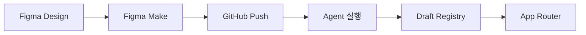

# Draft 프로젝트 아키텍처

> 1인 개발자를 위한 확장 가능한 농구 용병 모집 플랫폼

**최종 업데이트**: 2025-12-31

---

## 🏗️ 프로젝트 구조

```
draft-web/
├── app/                              # Next.js App Router (라우팅만)
│   ├── (guest)/                      # 게스트 전용 페이지
│   │   ├── page.tsx                  # 경기 목록
│   │   └── match/[id]/page.tsx       # 경기 상세
│   ├── (host)/                       # 호스트 전용 페이지
│   │   ├── create/page.tsx           # 경기 생성
│   │   └── dashboard/page.tsx        # 대시보드
│   ├── (user)/                       # 공통 유저 페이지
│   │   └── my/page.tsx               # 마이페이지
│   └── layout.tsx                    # 루트 레이아웃
│
├── src/                              # 소스 코드 (비즈니스 로직)
│   ├── components/                   # 컴포넌트
│   │   ├── registry/                 # 🔥 Figma에서 가져온 UI 컴포넌트
│   │   │   ├── match-create-form/
│   │   │   │   ├── index.tsx         # 컴포넌트 코드
│   │   │   │   ├── metadata.yaml     # 메타데이터
│   │   │   │   ├── README.md         # 문서
│   │   │   │   └── styles.css        # (optional) 커스텀 스타일
│   │   │   └── match-list-card/
│   │   └── ui/                       # shadcn/ui 기본 컴포넌트
│   │
│   ├── features/                     # 🔥 기능별 모듈 (Feature-Sliced Design)
│   │   ├── match/                    # 경기 관련 기능
│   │   │   ├── ui/                   # Match UI 컴포넌트
│   │   │   │   ├── MatchListItem.tsx
│   │   │   │   ├── FilterBar.tsx
│   │   │   │   └── ApplicationDrawer.tsx
│   │   │   ├── api/                  # API 함수 (Supabase)
│   │   │   │   ├── queries.ts        # React Query hooks (GET)
│   │   │   │   └── mutations.ts      # React Query hooks (POST/PUT/DELETE)
│   │   │   ├── model/                # 타입, 스키마
│   │   │   │   ├── types.ts          # TypeScript 타입
│   │   │   │   └── schema.ts         # Zod 스키마
│   │   │   └── lib/                  # 헬퍼 함수
│   │   │       └── format-date.ts
│   │   ├── auth/                     # 인증 기능
│   │   │   ├── ui/
│   │   │   ├── api/
│   │   │   ├── model/
│   │   │   └── lib/
│   │   └── user/                     # 유저 프로필
│   │
│   ├── shared/                       # 전역 공유 자원
│   │   ├── lib/                      # 유틸리티
│   │   │   ├── supabase.ts           # Supabase 클라이언트
│   │   │   ├── query-client.ts       # React Query 설정
│   │   │   └── utils.ts              # 일반 유틸
│   │   ├── config/                   # 설정
│   │   │   └── constants.ts
│   │   └── types/                    # 전역 타입
│   │       └── database.types.ts     # Supabase 생성 타입
│   │
│   └── widgets/                      # 조합형 컴포넌트
│       ├── Header.tsx                # 레이아웃 컴포넌트
│       └── BottomNav.tsx
│
├── scripts/                          # 자동화 스크립트
│   └── import-figma-component.py     # Figma → Draft 변환
│
├── .claude/                          # Claude Code Agents
│   ├── agents/
│   │   └── figma-ui-importer.md      # Figma UI 변환 Agent
│   ├── skills/
│   └── docs/
│
├── public/                           # 정적 파일
│   └── registry/                     # Registry 컴포넌트 asset
│
├── package.json
├── tsconfig.json
└── ARCHITECTURE.md                   # 이 파일
```

---

## 📐 설계 원칙

### 1. Feature-Sliced Design (간소화 버전)

**왜 Feature-Sliced?**
- ✅ 1인 개발에 최적: 기능별 독립 개발
- ✅ 확장성: 팀 확대 시 충돌 최소화
- ✅ 유지보수: 기능 단위 수정/삭제 용이
- ✅ 재사용성: 공통 컴포넌트 자동 분리

**계층 구조:**

```
Features (기능)
   ↓
Shared (공유)
   ↓
App (라우팅)
```

**컴포넌트 분리 원칙:**
- **단일 파일 제한**: 300줄 초과 시 분리 검토
- **구성**:
  - `*_view.tsx`: 페이지 전체 레이아웃 및 상태 관리 (Controller 역할)
  - `components/*`: 도메인별 하위 컴포넌트 (Presentational 역할)

### 2. Registry 패턴 (Monet 방식)

Figma Make에서 가져온 UI를 독립적으로 관리:

```typescript
// src/components/registry/{name}/
// - 각 컴포넌트가 독립적인 폴더
// - metadata.yaml로 메타데이터 관리
// - scripts로 자동화
```

**장점:**
- Figma UI 변경 시 해당 폴더만 업데이트
- 컴포넌트 검색/관리 용이
- 비즈니스 로직(features)과 분리

---

## 🎯 기술 스택

### Phase 1: 현재 (UI 개발)

| 카테고리 | 기술 | 용도 |
|---------|------|------|
| **Framework** | Next.js 16 (App Router) | SSR, Routing |
| **Language** | TypeScript | 타입 안정성 |
| **Styling** | Tailwind CSS 4 | 스타일링 |
| **UI Library** | shadcn/ui + Radix UI | 컴포넌트 |
| **Animation** | Framer Motion | 애니메이션 |
| **Form** | React Hook Form + Zod | 폼 검증 |

### Phase 2: Supabase 연결 (추후)

```bash
pnpm add @supabase/supabase-js @supabase/ssr @tanstack/react-query
```

| 카테고리 | 기술 | 용도 |
|---------|------|------|
| **Backend** | Supabase | 인증 + DB + Storage |
| **State** | React Query | 서버 상태 캐싱 |
| **Validation** | Zod | 런타임 검증 |

### Phase 3: 확장 (유저 증가 시)

```bash
pnpm add @vercel/kv @vercel/analytics @sentry/nextjs
```

---

## 📁 파일 명명 규칙

### 컴포넌트

| 위치 | 명명 규칙 | 예시 |
|------|---------|------|
| `src/components/registry/*` | kebab-case | `match-create-form/` |
| `src/features/*/ui/*` | PascalCase | `MatchListItem.tsx` |
| `src/components/ui/*` | kebab-case | `button.tsx` |
| `src/widgets/*` | PascalCase | `Header.tsx` |

### 기타 파일

| 타입 | 명명 규칙 | 예시 |
|------|---------|------|
| API 함수 | 복수형 | `queries.ts`, `mutations.ts` |
| 타입 정의 | `.types.ts` | `match.types.ts` |
| 스키마 | `.schema.ts` | `match.schema.ts` |
| 헬퍼 함수 | kebab-case | `format-date.ts` |
| Agent | kebab-case | `figma-ui-importer.md` |

---

## 🔄 Figma → Draft 워크플로우

### 자동화 프로세스



### 실행 방법

1. **Figma Make 코드 생성**
   ```
   Figma → Figma Make → /tmp/figma-sample
   ```

2. **Draft로 Import**
   ```bash
   python3 scripts/import-figma-component.py \
     --name "match-create-form" \
     --source-file "/tmp/figma-sample/src/pages/HostCreateMatch.tsx" \
     --category "form"
   ```

3. **Agent 사용 (자동)**
   ```
   Claude Code가 figma-ui-importer Agent를 자동 실행
   ```

4. **App Router에 연결**
   ```tsx
   // app/(host)/create/page.tsx
   import MatchCreateForm from '@/components/registry/match-create-form';

   export default function Page() {
     return <MatchCreateForm />;
   }
   ```

---

## 🤖 Agent 사용 가이드

### Figma UI Importer Agent

**언제 사용:**
- Figma Make에서 새 UI 컴포넌트 가져올 때
- 기존 Figma 컴포넌트 업데이트 시

**실행:**
```
"Figma의 HostCreateMatch 컴포넌트를 Draft로 import 해줘"
```

**Agent가 수행:**
1. Figma Make 코드 분석
2. Draft 구조로 변환
3. Registry에 등록
4. Import 경로 업데이트
5. TypeScript 에러 체크

---

## 📊 확장성 로드맵

### 사용자 수별 대응

| 사용자 수 | 인프라 | 비용 | 필요 작업 |
|----------|--------|------|----------|
| ~1,000 | Supabase Free + Vercel Hobby | 무료 | DB 연결 |
| ~10,000 | Supabase Pro + Vercel Pro + Redis | ~$50/월 | 캐싱 추가 |
| ~100,000 | Supabase Team + Edge Functions | ~$500/월 | CDN, 최적화 |

### Feature 추가 예시

```bash
# 새 Feature 추가: 팀 관리
mkdir -p src/features/team/{ui,api,model,lib}

# UI 컴포넌트
touch src/features/team/ui/TeamList.tsx

# API 함수
touch src/features/team/api/queries.ts

# 타입 정의
touch src/features/team/model/types.ts
```

**장점: 다른 Feature에 영향 없음** ✅

---

## 🔐 Supabase 통합 계획 (Phase 2)

### 1. 환경 변수 설정

```bash
# .env.local
NEXT_PUBLIC_SUPABASE_URL=your-project-url
NEXT_PUBLIC_SUPABASE_ANON_KEY=your-anon-key
```

### 2. Supabase 클라이언트

```typescript
// src/shared/lib/supabase.ts
import { createBrowserClient } from '@supabase/ssr';

export const supabase = createBrowserClient(
  process.env.NEXT_PUBLIC_SUPABASE_URL!,
  process.env.NEXT_PUBLIC_SUPABASE_ANON_KEY!
);
```

### 3. React Query 설정

```typescript
// src/shared/lib/query-client.ts
import { QueryClient } from '@tanstack/react-query';

export const queryClient = new QueryClient({
  defaultOptions: {
    queries: {
      staleTime: 60 * 1000, // 1분
      cacheTime: 5 * 60 * 1000, // 5분
    },
  },
});
```

### 4. API 함수 작성

```typescript
// src/features/match/api/queries.ts
import { useQuery } from '@tanstack/react-query';
import { supabase } from '@/shared/lib/supabase';

export const useMatches = () => {
  return useQuery({
    queryKey: ['matches'],
    queryFn: async () => {
      const { data, error } = await supabase
        .from('matches')
        .select('*')
        .order('date', { ascending: true });

      if (error) throw error;
      return data;
    },
  });
};
```

---

## 📝 개발 가이드

### 새 기능 추가 시

1. **Feature 생성**
   ```bash
   mkdir -p src/features/{feature-name}/{ui,api,model,lib}
   ```

2. **Figma UI 가져오기** (있으면)
   ```bash
   python3 scripts/import-figma-component.py --name "{name}"
   ```

3. **타입 정의**
   ```typescript
   // src/features/{feature}/model/types.ts
   export interface Feature {
     id: string;
     // ...
   }
   ```

4. **API 함수 작성** (Supabase 연결 후)
   ```typescript
   // src/features/{feature}/api/queries.ts
   export const useFeatures = () => { /* ... */ };
   ```

5. **페이지 연결**
   ```tsx
   // app/(...)/page.tsx
   import Feature from '@/features/{feature}/ui/FeatureComponent';
   ```

### Auto-Generated 파일 구분

모든 Agent가 생성한 파일에는 헤더가 있음:

```typescript
/**
 * 🤖 AUTO-GENERATED by {agent-name}
 * 생성일: {DATE}
 * Agent: .claude/agents/{agent-name}.md
 */
```

**수동 수정 주의**: Agent 재실행 시 덮어쓰여질 수 있음

---

## ⚠️ 주의사항

### DO ✅

- ✅ Feature 단위로 개발
- ✅ Figma UI는 Registry에만 저장
- ✅ TypeScript 타입 100% 정의
- ✅ Agent 스크립트 사용
- ✅ AUTO-GENERATED 헤더 확인

### DON'T ❌

- ❌ Registry 파일 직접 수정
- ❌ App Router에 비즈니스 로직 작성
- ❌ Feature 간 직접 import
- ❌ 절대 경로 대신 상대 경로 사용
- ❌ any 타입 사용

---

## 🔗 참고 문서

- [Agent 생성 가이드](.claude/docs/agent-creation-guide.md)
- [Subagent 문서](.claude/docs/sub-agent.md)
- [Figma UI Importer](.claude/agents/figma-ui-importer.md)
- [Next.js App Router](https://nextjs.org/docs/app)
- [Supabase Docs](https://supabase.com/docs)
- [Feature-Sliced Design](https://feature-sliced.design/)

---

---

## 📝 프로젝트 컨텍스트 (AI Agent용)

### 프로젝트 개요

**Draft**는 농구 용병 모집 플랫폼으로, 개인/팀이 경기를 등록하고 포지션별로 플레이어를 모집할 수 있는 서비스입니다.

**개발 단계:**
- **Phase 1 (현재)**: MVP - Guest Recruitment + Pickup Games (UI 구현 완료, 모크 데이터 사용)
- **Phase 2 (예정)**: Basketball Lifestyle Platform (Supabase 연동, 장비 대여, 카풀, 레슨 기능 추가)

**기술 스택:**
- Next.js 16 (App Router) + React 19
- TypeScript (strict mode)
- Tailwind CSS 4 + shadcn/ui
- Zod (검증) + React Hook Form
- 계획: Supabase + React Query (Phase 2)

---

### 최근 작업 내역 (2026-01-10)

#### 1. 보안 강화
- **Kakao API 키 서버사이드 마이그레이션**
  - 파일: `app/api/search-places/route.ts` (신규)
  - 변경: `NEXT_PUBLIC_KAKAO_REST_API_KEY` → `KAKAO_REST_API_KEY` (클라이언트 노출 방지)
  - 클라이언트: `src/shared/api/kakao-map.ts`에서 `/api/search-places` 호출

- **보안 헤더 설정**
  - 파일: `next.config.ts`
  - 추가: X-Frame-Options, X-Content-Type-Options, Referrer-Policy, X-XSS-Protection

#### 2. 입력 검증 (Zod)
- **Match Create 폼 검증**
  - 파일: `src/features/match/create/model/schema.ts` (신규)
  - 13개 검증 규칙: 날짜, 시간, 장소, 가격, 포지션, 매치 타입, 성별, 레벨 등
  - 통합: `match-create-view.tsx`에서 `safeParse()` 사용 (비침습적 방식)

#### 3. 타입 시스템 통합 (Phase 2 준비)
- **공통 타입 파일 생성**
  - 파일: `src/shared/types/match.ts` (신규)
  - Enum: `MatchType`, `MatchStatus`, `ApplicantStatus`
  - 인터페이스:
    - `Location` (latitude, longitude 포함 - 카풀/검색용)
    - `PriceInfo` (base + modifiers 구조 - 가격 옵션 확장 가능)
    - `BaseMatch`, `HostDashboardMatch`, `GuestListMatch`
  - 설계 원칙: JSONB 스타일 facilities 필드 (하드코딩 제거)

- **타입 마이그레이션 완료**
  - Host Feature: `src/features/host/model/types.ts`에서 공통 타입 import
  - Match Feature: `parking`, `shower` 개별 필드 → `facilities: { parking: 'free', shower: true }` 형식으로 변경
  - 모든 모크 데이터 업데이트 완료

#### 4. 커밋 이력
총 9개 커밋 (기능 6개 + 보안/검증 3개):
1. `추가(ui): shadcn/ui 컴포넌트 4개 추가`
2. `기능(host): Host Dashboard 타입 및 인터페이스 정의`
3. `기능(host): Host Dashboard 테스트용 모크 데이터 추가`
4. `기능(host): Host Dashboard 종합 UI 구현 (신청자 관리 포함)`
5. `기능(pages): Schedule, Team 페이지 라우트 추가`
6. `문서(docs): Figma-to-Code 구현 가이드 추가`
7. `보안(api): Kakao API 키 서버사이드 마이그레이션 + 보안 헤더 설정`
8. `기능(validation): Match Create 폼에 Zod 검증 추가`
9. `리팩터링(types): 공통 타입 시스템으로 마이그레이션 (Phase 2 확장성 준수)`

---

### Phase 2 확장성 설계 가이드라인 (필수 준수)

#### 비즈니스 컨텍스트
- MVP: Guest Recruitment + Pickup Games
- Phase 2: 장비 대여, 카풀, 레슨, 토너먼트

#### 코딩 원칙

**1. 유연한 매치 속성 관리**
```typescript
// ❌ Bad: 하드코딩
interface Match {
  parking: 'free' | 'paid' | 'impossible';
  shower: boolean;
}

// ✅ Good: JSONB 스타일 (확장 가능)
interface Match {
  facilities: Record<string, any>; // { parking: 'free', shower: true, equipment: 'provided' }
}
```

**2. 가격 구조 확장성**
```typescript
// ✅ Base Price + Modifiers 모델
interface PriceInfo {
  base: number;                    // 기본 가격
  modifiers?: Array<{
    type: 'CARPOOL_DISCOUNT' | 'EQUIPMENT_FEE';
    amount: number;                // 양수(추가) 또는 음수(할인)
  }>;
  final: number;                   // 계산된 최종 가격
}
```

**3. 지리적 위치 필수 저장**
```typescript
// ✅ 항상 latitude, longitude 포함 (카풀/검색 전제조건)
interface Location {
  name: string;       // "강남구민회관"
  address: string;    // "서울 강남구 삼성로 123"
  latitude: number;   // 필수
  longitude: number;  // 필수
}
```

**4. 매치 타입 Enum**
```typescript
export enum MatchType {
  GUEST_RECRUIT = 'GUEST_RECRUIT',  // MVP
  PICKUP_GAME = 'PICKUP_GAME',      // MVP
  TUTORIAL = 'TUTORIAL',            // Phase 2
  LESSON = 'LESSON',                // Phase 2
  TOURNAMENT = 'TOURNAMENT',        // Future
}
```

**5. 사용자 프로필 확장성**
```typescript
// Core Auth (변경 불가)
interface User {
  id: string;
  email: string;
}

// Extended Profile (확장 가능)
interface UserProfile {
  userId: string;
  hasCar?: boolean;            // Phase 2: 카풀
  yearsOfExperience?: number;  // Phase 2: 레슨
  equipmentOwned?: string[];   // Phase 2: 장비 공유
}
```

#### 설계 목표
> **"Core Logic"과 "Feature Specifics"를 분리하여 Phase 2 진입 시 DB 스키마 전면 리팩토링 불필요**

---

### 아키텍처 평가 (2026-01-10)

**종합 점수: 8.9/10** (보안 강화 후)

| 영역 | 점수 | 평가 |
|-----|------|------|
| 확장성 | 8.5/10 | FSD 구조 탁월, API 레이어 Phase 2에 추가 예정 |
| 유지보수성 | 8.5/10 | 타입 통합 완료, 문서화 우수, 테스트 인프라 부재 |
| 성능 | 8.0/10 | 현재 최적, 스케일 대비 페이지네이션 필요 |
| 보안 | 9.5/10 | API 키 보호 ✓, 보안 헤더 ✓, 입력 검증 ✓ |

**강점:**
- Feature-Sliced Design 올바르게 구현
- TypeScript strict mode, `any` 타입 0개
- 탁월한 문서화 (ARCHITECTURE.md 428줄, CLAUDE.md, FIGMA_TO_CODE.md)
- Phase 2 확장성 준비 완료

**개선 권장사항:**
- Phase 2: Supabase + React Query 통합
- 테스트 인프라 구축 (Vitest + React Testing Library)
- API 레이어 스켈레톤 추가 (`src/features/*/api/`)

---

### 주요 파일 위치

**타입 정의:**
- 공통 타입: `src/shared/types/match.ts`
- Host Feature: `src/features/host/model/types.ts`
- Match Feature: `src/features/match/model/mock-data.ts`

**검증 스키마:**
- Match Create: `src/features/match/create/model/schema.ts`

**API 관련:**
- Kakao Maps: `app/api/search-places/route.ts` (서버), `src/shared/api/kakao-map.ts` (클라이언트)

**모크 데이터:**
- Host Dashboard: `src/features/host/model/mock-data.ts`
- Match List: `src/features/match/model/mock-data.ts`

**주요 UI:**
- Host Dashboard: `src/features/host/ui/host-dashboard-view.tsx` (547줄)
- Match Create: `src/features/match/create/ui/match-create-view.tsx` (725줄 추정)

---

### 팀 확장 준비도

**1명 → 2-3명:** ✅ 즉시 가능 (Feature 단위 분업)
**1명 → 5명+:** ⚠️ 테스트 + CI/CD 필요

**확장 경로:**
- 1K 사용자: 현재 아키텍처로 충분
- 10K 사용자: React Query + Supabase
- 100K 사용자: DB 최적화 + CDN + Edge Functions

---

**Last Updated**: 2026-01-10
**Maintainer**: @beom
**Project**: Draft - 농구 용병 모집 플랫폼
